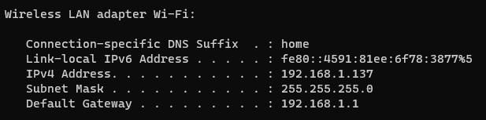

# Sign Language Detection

To ensure proper functionality of the application, it is important to start the python service first and then launch the mobile app. Follow these steps:

1. Start the Python service by following the installation instructions mentioned above.

2. Once the Python service is up and running, proceed with the installation of the Mobile App.

3. Make sure you have Node.js installed on your system.

4. Install the Expo Go Mobile App on your device for testing purposes.

5. Open the Terminal and run the following command to check your IPv4 Address:
```sh
ipconfig
```

6. Copy the IPv4 Address and paste it into the .env file after EXPO_PUBLIC_IPV4=.

7. Run the following commands in the Terminal:
```sh
npm install
npm start
```

8. The Mobile App will now be launched and connected to the Python service.

Remember to start the Python service before starting the Mobile App to ensure seamless communication between the two components.


## Installation python-service

### Requirements

To install the necessary packages for the python-service, run the following command:

```sh
pip install opencv-python numpy matplotlib mediapipe scikit-learn tensorflow fastapi
```

### Predict API

To start the Predict API, navigate to the `python-service` directory and run the following command:

```sh
cd python-service
py -m uvicorn predict:app
```

### Docker Installation

To install the python-service using Docker, follow these steps:

1. Navigate to the `python-service` directory.
2. Pull the Docker image:

```sh
docker pull tiangolo/uvicorn-gunicorn-fastapi
```

3. Build the Docker image:

```sh
docker build -t myapp .
```

4. Run the Docker container:

```sh
docker run -p 80:80 myapp
```


## Installation Mobile App

### Requirements
- Node.js
- Expo Go Mobile App (For Testing)

### Setup
- Open Terminal
```sh
ipconfig
```

- Copy the IPv4 Address and paste it into the .env file after EXPO_PUBLIC_IPV4=
```sh
npm install
npm start
```